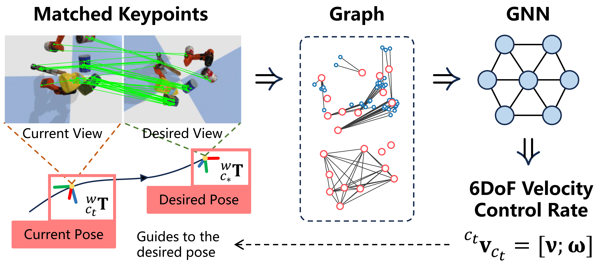
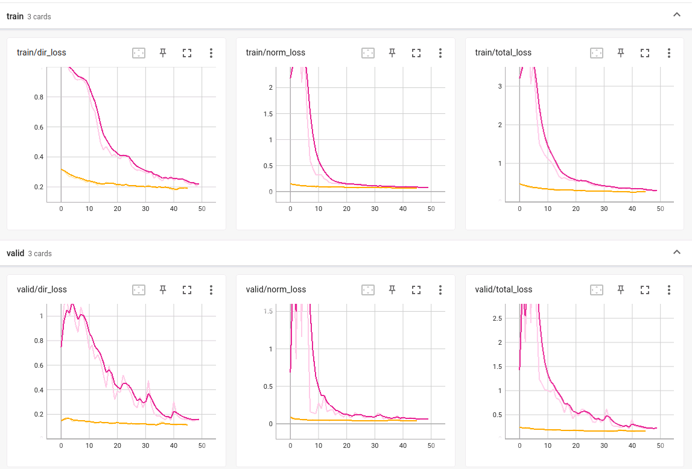

# CNS Training and Inference Demos

## Introduction

This is the official implementation of our paper "CNS: Correspondence Encoded Neural Image Servo Policy". We present a graph neural network based solution for image servo utilizing explicit keypoints correspondence obtained from any detector-based feature matching methods, such as SIFT, AKAZE, ORB, SuperGlue and etc. 

<p align="center">

</p>

Our model achieves <0.3° and sub-millimeter precision in real-world experiments (mean distance to target ≈ 0.275m) and runs in real-time (~40 fps with ORB as front-end).

* Full paper: https://arxiv.org/abs/2309.09047
* Homepage: https://hhcaz.github.io/CNS-home
* Video: https://www.bilibili.com/video/BV1cK4y1F7un

We provide the pre-trained model in `checkpoints` folder. See demo in script `demo_sim_Erender.py` which launches 150 servo episodes in simulation environment ${\rm E}_{\rm render}$ as described in the main text. We use `demo_real_ur5.py` to benchmark methods in real-world environments but you may need to adapt the code to fit your own robot.


## Dependencies

* **(Required)** We use [PyTorch](https://pytorch.org) (>1.12) and [PyG](https://pytorch-geometric.readthedocs.io/en/latest/index.html) (PyTorch Geometric). Please follow their official guidelines to install them. Note the version of PyG should be compatible with PyTorch. Here are the additional dependencies, they can be installed via pip:

  ```
  pip install tqdm numpy scipy pybullet matplotlib tensorboard scikit-image open3d>=0.12.0 opencv-python>=4.8.0 pyrealsense2==2.53.1.4623
  ```

* (Optional, YCB objects)  If you want to use the same simulation environment setup ${\rm E}_{\rm render}$ as this work, you need to download the YCB object models from [this repo](https://github.com/eleramp/pybullet-object-models) and put them in folder `cns/thirdparty/`:

  ```
  cd cns/thirdparty
  git clone https://github.com/eleramp/pybullet-object-models.git
  ```

* (Optional, SuperGlue) If you want to use SuperGlue as the observer, you need to manually download it from [this repo](https://github.com/magicleap/SuperGluePretrainedNetwork.git):

  ```
  cd cns/thirdparty
  git clone https://github.com/magicleap/SuperGluePretrainedNetwork.git
  cd SuperGluePretrainedNetwork
  python prepare_superglue.py
  ```

  **Note:** the original implementation of SuperGlue may fail with large in-plane rotation. We follow the solution in [this issue](https://github.com/magicleap/SuperGluePretrainedNetwork/issues/59) to rotate the desired image multiple times for matching and then rotate the matched keypoints back. Thanks to [kyuhyoung](https://github.com/kyuhyoung/SuperGluePretrainedNetwork) for providing scripts. 

  When initializing the front-end, you need to specify `detector="SuperGlue:0123"` to enable this feature. (`SuperGlue:0123` uses images rotated 3 times, `SuperGlue:02` uses the original image and image rotated by 180°, `SuperGlue` uses original image only.)


## How to Use

There are three steps to go to use CNS in a general image servo task.

### 1. Initialize the pipeline

First initialize the pipeline, this could be direct instantiation with proper arguments:

```python
from cns.utils.perception import CameraIntrinsic
from cns.benchmark.pipeline import CorrespondenceBasedPipeline, VisOpt

pipeline = CorrespondenceBasedPipeline(
    ckpt_path="<path-to-the-checkpoint>",
    detector="SIFT",  # this could be ORB, AKAZE, or any other existing methods
                      # in OpenCV, and additionally, SuperGlue
    device="cuda:0",  # or "cpu" if cuda is not available
    intrinsic=CameraIntrinsic.default(),  # we use default camera intrinsic here, 
                                          # changes to your camera intrinsic
    ransac=True,  # whether conduct ransac after keypoints detection and matching
    vis=VisOpt.ALL  # can be KP (keypoints), MATCH, GRAPH and their combinitions, or NO
)
```

or loading from a `json` file:

```python
pipeline = CorrespondenceBasedPipeline.from_file("pipeline.json")
```

The `json` file looks like:

```json
{
    "intrinsic": {
        "width": 640,
        "height": 480,
        "K": [
            615.7113,      0.0, 315.7990,  // fx  0 cx
                 0.0, 615.7556, 248.1492,  //  0 fy cy
                 0.0,      0.0,      1.0   //  0  0  1
        ]
    },
    "detector": "SIFT",
    "checkpoint": "checkpoints/cns.pth",
    "device": "cuda:0",
    "visualize": "MATCH|GRAPH"
}
```

**Note:** Currently enabling the visualization will introduce extra time delay in the control system, the controller may damp around the desired pose and takes longer time to convergence (to stop itself).

### 2. Specify the desired image and distance prior

The desired image is a numpy array of `shape = (H, W, 3)` and `dtype = uint8`. Channels are ordered in BGR format. The distance prior is a scalar representing the distance from camera to scene center in the desired pose. The distance prior can be roughly estimated if the ground truth value is hard to obtain (we recommend to **underestimate** the value if your are not sure about the ground truth, for example, if the ground truth is 0.5m, you can set this to a value between 0.25~0.5).

```python
pipeline.set_target(
    desired_image,  # numpy array, shape = (H, W, 3), dtype = uint8, BGR format
    distance_prior  # a scalar
)
```

### 3. Get current observation, calculate the velocity control rate and conduct it

User needs to implement the details of `get_obervation` and `conduct_velocity_control`. Method `pipeline.get_control_rate` returns: (1) a 6-DoF camera velocity in camera frame $[v_x, v_y, v_z, w_x, w_y, w_z]$, (2) data representing the graph structure and (3) a dictionary recording time cost on front-end, graph construction and neural network forward.

```python
while True:
    current_image = get_observation()
    velocity, data, timing = pipeline.get_control_rate(current_image)
    conduct_velocity_control(velocity)
```

That's all. But you may want to know when is appropriate to terminate the servo episode. We provide two stop policy: `PixelStopPolicy` and `SSIMStopPolicy`. The first one evaluates the points position error of detected keypoints between current image and desired image, while the second one evaluates the SSIM between current and desired image. Adding stop policy to the servo process yields:

```python
import time
from cns.benchmark.stop_policy import PixelStopPolicy, SSIMStopPolicy

stop_policy = PixelStopPolicy(
    waiting_time=2.0,  # 2 secs
    conduct_thresh=0.01  # error threshold
)
# # or use SSIMStopPolicy policy
# stop_policy = SSIMStopPolicy(
#     waiting_time=2.0,  # 2 secs
#     conduct_thresh=0.1  # error threshold
# )

stop_policy.reset()  # need to be called right before starting the servo process
while True:
    current_image = get_observation()
    velocity, data, timing = pipeline.get_control_rate(current_image)
    if stop_policy(data, time.time()):
        break
    conduct_velocity_control(velocity)
```

The `stop_policy` calculate the error and if the error is lower than `conduct_thresh` and doesn't decrease anymore for certain time (specified by `waiting_time`), it returns `True` to indicate that it's time to terminate. We don't use fixed error threshold for termination because different front-ends give different qualities of keypoints and correspondence. We'd rather use an adaptive scheme for termination when the error is relative small and doesn't decrease (is larger than the historical minimum value) for a while. You can also use your own stop policy with necessary information stored in `data` (including current and desired point positions and images).

**Note:** `PixelStopPolicy` calculate L2 norm of keypoints position error (in **normalized image plane**).


## Training and Evaluation

**1. Training**

First train CNS with short trajectory sequences for faster convergence (~9h on single RTX 2080Ti):

```shell
python train_cns.py --batch-size=64 --epochs=50 --init-lr=1e-3 --weight-decay=1e-4 --device="cuda:0" --gui --save
```

The trained model is saved as, for example, `checkpoints/datetime_CNS/checkpoint_best.pth`. The model can already be used for servoing. But train it with longer sequences will improve the final precision (costs another ~6h):

```shell
python train_cns.py --batch-size=16 --epochs=50 --init-lr=1e-4 --weight-decay=1e-4 --device="cuda:0" --load=checkpoints/datetime_CNS/checkpoint_best.pth --gui --long --save
```

You can see the loss curve via:

```
tensorboard --logdir="logs"
```



**2. Evaluation**

Please follow the example script in `cns/benchmark/tests.py` to prepare checkpoints and environment.


## Acknowledgement

We use the following repositories in this project:

* [pybullet-object-models](https://github.com/eleramp/pybullet-object-models): We use YCB object models to create servo scenes in simulated environment.
* [SuperGlue](https://github.com/magicleap/SuperGluePretrainedNetwork): We use SuperGlue as a candidate observer.


## BibTex Citation

If you found it helpful to you, please consider citing:

```
@misc{chen2023cns,
      title={CNS: Correspondence Encoded Neural Image Servo Policy}, 
      author={Anzhe Chen and Hongxiang Yu and Yue Wang and Rong Xiong},
      year={2023},
      eprint={2309.09047},
      archivePrefix={arXiv},
      primaryClass={cs.RO}
}
```

